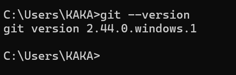
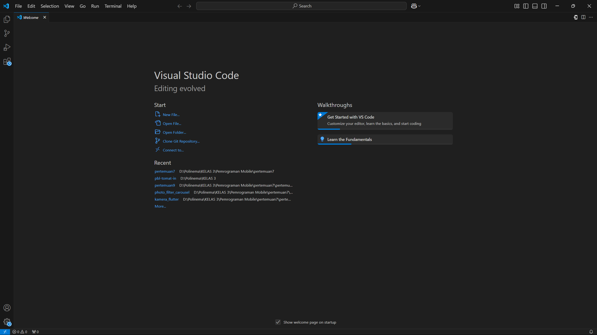
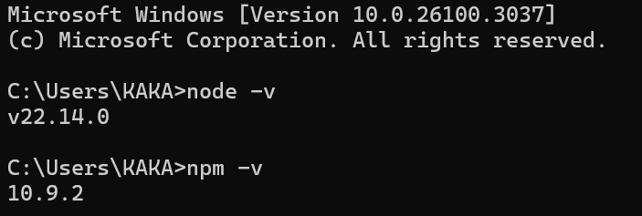

# Praktikum 1: Menyiapkan Lingkungan Pengembangan

|              | **Pemrograman Berbasis Framework 2025** |
|--------------|------------------------------------|
| **NIM**     | 2241720175                         |
| **Nama**    | Mochammad Zakaro Al Fajri          |
| **Kelas**   | TI - 3D                            |

## Soal Praktikum 2

## Pertanyaan Praktikum 1
1. Jelaskan kegunaan masing-masing dari Git, VS Code dan NodeJS yang telah Anda install
pada sesi praktikum ini!

2. Buktikan dengan screenshoot yang menunjukkan bahwa masing-masing tools tersebut
telah berhasil terinstall di perangkat Anda!

## Jawaban Praktikum 1
1. Fungsi Git, VS Code dan NodeJS :
    - Git merupakan kontrol versi yang membantu developer dalam melacak perubahan dalam kode selama pengembangan perangkat lunak. Selain itu, developer juga dapat membuat kolaborasi dengan tim lebih efisien karena setiap perubahan kode dapat disimpan, dibandingkan, dan dikembalikan ke versi sebelumnya jika diperlukan.

    - VS Code merupakan code editor yang sangat populer dikarenakan berbagai fiturnya. Vs code   menyediakan berbagai fitur seperti syntax highlighting, debugging, integrasi dengan Git, dan juga extension yang dapat membantu developer dalam proses pengembangan perangkat lunak

    - Node.js merupakan  runtime environment untuk menjalankan JavaScript di luar browser (server-side). Node.js memungkin developer untuk  pengembangan aplikasi backend menggunakan JavaScript serta adanya Npm yang sangat membantu dalam menginstal library dan tools

2. Bukti instalasi
    - Git 

        

    - Vs code 

        

    - Node.js

        
