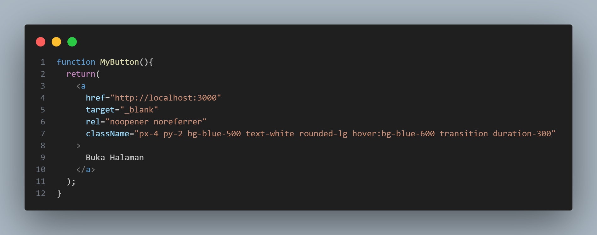
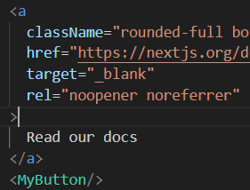
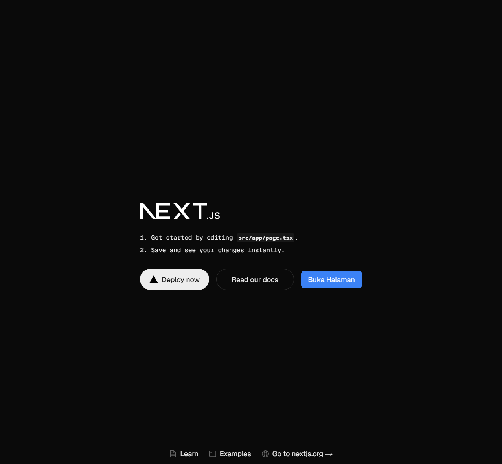

# Praktikum 3: Menambahkan Komponen React (Button)
|              | **Pemrograman Berbasis Framework 2025** |
|--------------|------------------------------------|
| **NIM**     | 2241720175                         |
| **Nama**    | Mochammad Zakaro Al Fajri          |
| **Kelas**   | TI - 3D                            |

## Soal Praktikum 3

1. Buktikan dengan screenshoot yang menunjukkan bahwa tahapan percobaan di atas telah berhasil Anda lakukan!
    
    Jawab :
        
    - Langkah 1 : Tambahkan fungsi MyButton yang mengembalikan markup komponen button yang akan ditambahkan ke dalam webpage

        
    
    - Langkah 2 : Tambahkan komponen button tersebut di samping button Read Our Docs

        

    - Langkah 3 : Simpan perubahan dan coba lihat perubahan melalui web browser!

        

