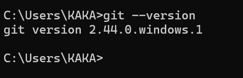
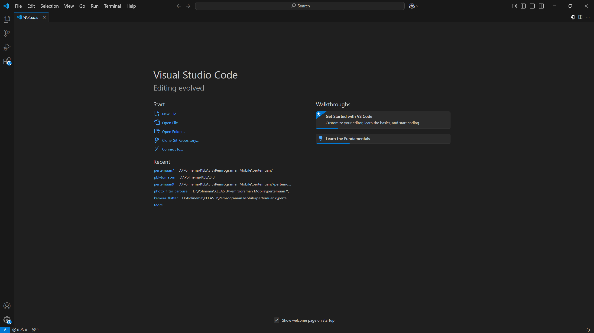
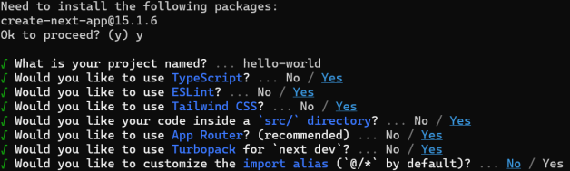
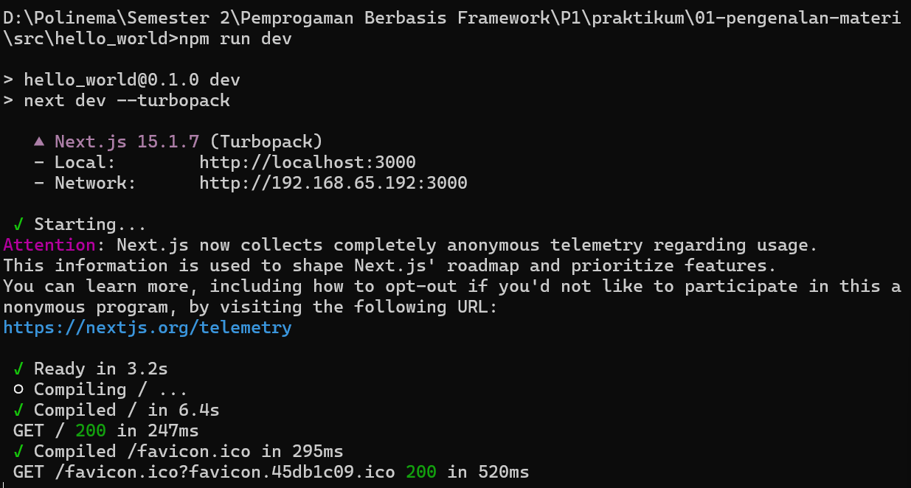
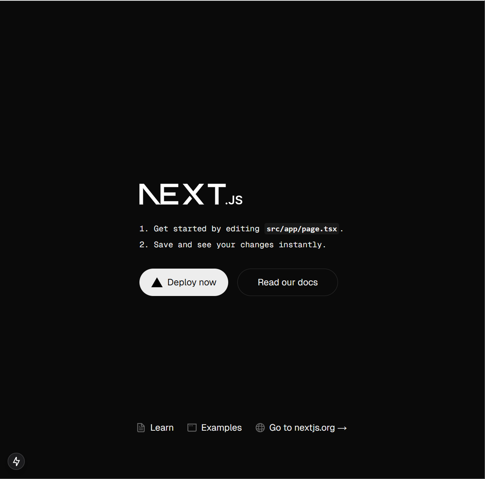
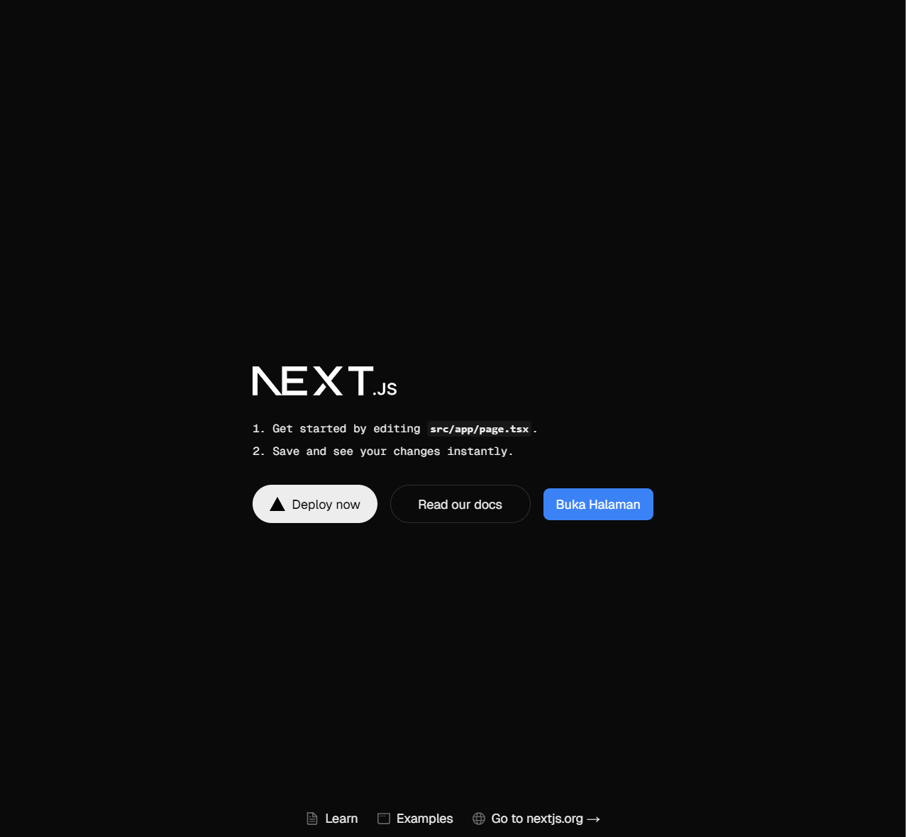
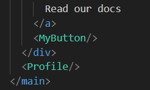
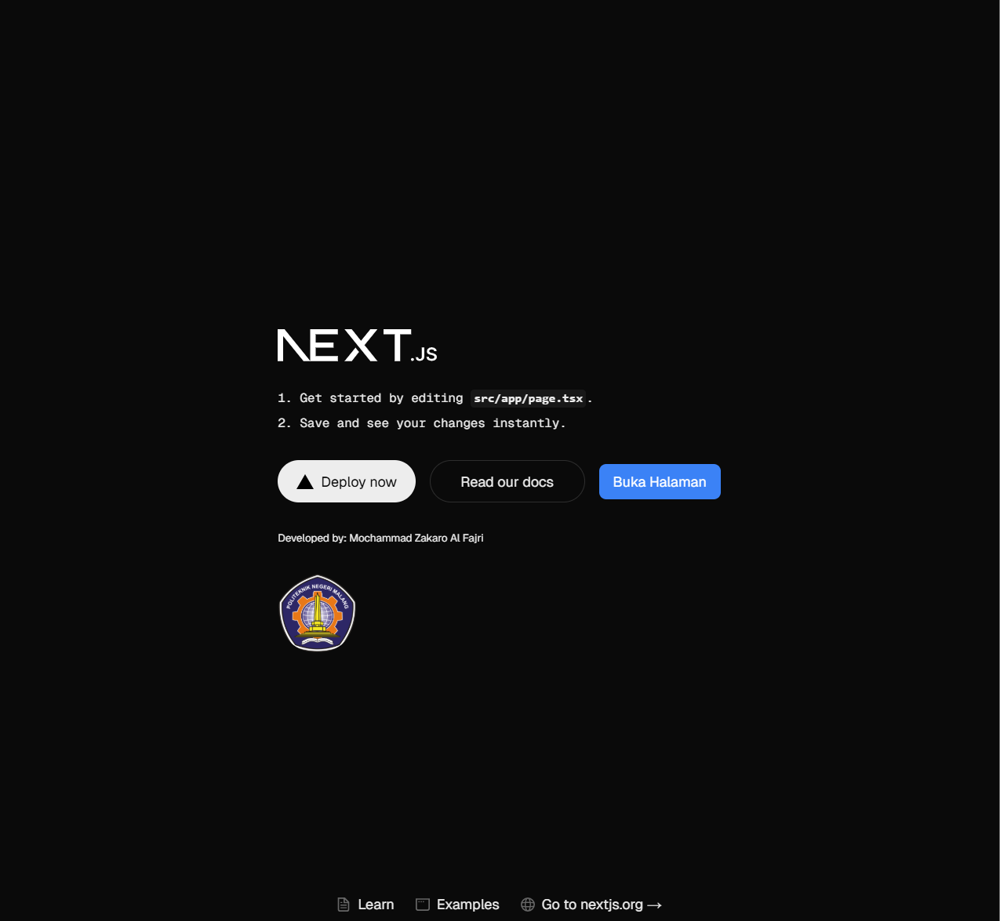

# Praktikum 1: Menyiapkan Lingkungan Pengembangan

|              | **Pemrograman Berbasis Framework 2025** |
|--------------|------------------------------------|
| **NIM**     | 2241720175                         |
| **Nama**    | Mochammad Zakaro Al Fajri          |
| **Kelas**   | TI - 3D                            |

## Soal Praktikum 2

## Pertanyaan Praktikum 1
1. Jelaskan kegunaan masing-masing dari Git, VS Code dan NodeJS yang telah Anda install
pada sesi praktikum ini!

2. Buktikan dengan screenshoot yang menunjukkan bahwa masing-masing tools tersebut
telah berhasil terinstall di perangkat Anda!

## Jawaban Praktikum 1
1. Fungsi Git, VS Code dan NodeJS :
    - Git merupakan kontrol versi yang membantu developer dalam melacak perubahan dalam kode selama pengembangan perangkat lunak. Selain itu, developer juga dapat membuat kolaborasi dengan tim lebih efisien karena setiap perubahan kode dapat disimpan, dibandingkan, dan dikembalikan ke versi sebelumnya jika diperlukan.

    - VS Code merupakan code editor yang sangat populer dikarenakan berbagai fiturnya. Vs code   menyediakan berbagai fitur seperti syntax highlighting, debugging, integrasi dengan Git, dan juga extension yang dapat membantu developer dalam proses pengembangan perangkat lunak

    - Node.js merupakan  runtime environment untuk menjalankan JavaScript di luar browser (server-side). Node.js memungkin developer untuk  pengembangan aplikasi backend menggunakan JavaScript serta adanya Npm yang sangat membantu dalam menginstal library dan tools

2. Bukti instalasi
    - Git 

        

    - Vs code 

        

    - Node.js

        

## Soal Praktikum 2

1. Pada Langkah ke-2, setelah membuat proyek baru menggunakan Next.js, terdapat beberapa istilah yang muncul. Jelaskan istilah tersebut, TypeScript, ESLint, Tailwind CSS, App Router, Import alias, App router, dan Turbopack!

    Jawab :
     - TypeScript adalah bahasa pemrograman yang memperluas JavaScript, yang berarti semua kode JavaScript valid dalam TypeScript. TypeScript menambahkan fitur seperti static typing, interfaces, dan classes untuk membantu pengembang menulis kode yang lebih aman dan mudah dikelola. TypeScript dikompilasi menjadi JavaScript agar dapat dijalankan di browser atau lingkungan Node.js.
     - ESLint adalah tools untuk memeriksa dan memperbaiki masalah kode JavaScript/TypeScript, menjaga konsistensi dan kualitas kode.
     - Tailwind CSS: Framework CSS yang menggunakan kelas utilitas untuk membangun UI dengan cepat tanpa menulis CSS kustom.
     - App Router adalah sistem routing yang digunakan dalam framework Next.js Yang menggantikan sistem routing berbasis file lama (pages/) dengan struktur yang lebih fleksibel dan berbasis komponen sehingga memungkinkan developer untuk mengatur routing, layout, dan data fetching dengan lebih intuitif, serta mendukung fitur seperti Server Components dan Nested Layouts.
     - Import Alias: Teknik untuk menyederhanakan jalur impor file, misalnya mengganti ../../../components dengan @components.
     - Turbopack adalah bundler JavaScript baru dan diklaim sebagai bundler tercepat untuk pengembangan JavaScript dan TypeScript. Ini dirancang khusus untuk mempercepat proses pengembangan dengan waktu build yang sangat cepat, terutama dalam proyek besar.

2. Apa saja kegunaak folder dan file yang ada pada struktur proyek React yang tampil pada gambar pada tahap percobaan ke-3!
    
    Jawab : Berikut ini merupakan fungsi dari tiap file dan folder dari react
    
    - **.next**: Folder ini dibuat secara otomatis oleh Next.js dan berisi hasil build proyek, seperti file HTML, CSS, dan JavaScript yang dihasilkan untuk produksi.
    - **node_modules**: Folder ini berisi semua dependensi dan library yang diinstal untuk proyek melalui npm atau yarn.
    - **public** : Folder ini digunakan untuk menyimpan aset statis seperti gambar, font, atau file lain.
    - **src/app**: Direktori utama aplikasi yang  berisi:
        - favicon.ico: Berisikan Ikon situs.
        - globals.css: Berisikan CSS global untuk aplikasi.
        - layout.tsx: Berisikan Layout umum aplikasi.
        - page.tsx: Berisikan Halaman utama aplikasi.
    - **.gitignore** : File yang berfungsi menentukan file dan folder yang harus diabaikan oleh git. Contoh : node_modules
    - **eslint.config.mjs** : merupakan file konfigurasi dari eslint
    - **next-env.d.ts** : File yang digunakan untuk menyesuaikan perilaku framework
    - **package-lock.json** : File yang digunakan untuk mengunci versi depedensi yang digunakan dan diinstal saat ini
    - **package.json** : File yang berisikan metadata, script dan list dependensi dari projek
    - **postcss.config.mjs** : File yang diguakan untuk konfigurasi dari postCSS (tools yang memproses CSS)
    - **tailwind.config.ts** : File yang digunakan untuk konfigurasi dari tailwind CSS
    - **tsconfig.json** : File yang digunakan utnuk konfigurasi dari typescript dan menentukan opsi dari kompilasi pengaturan projek

3. Buktikan dengan screenshoot yang menunjukkan bahwa tahapan percobaan di atas telah berhasil Anda lakukan!

    Jawab : 
    
    - Langkah 1 : Membuat folder proyek baru dengan nama belajar-react. Melalui konsol/command prompt/CMD masuk ke dalam folder tersebut dan jalankan perintah ini: "npx create-next-app"
        
        

    - Langkah 2 : Buka folder proyek hello-world menggunakan VS Code

        

    - Langkah 3 : Running proyek hello-world dengan memasukkan perintah di bawah ini melalui konsol atau terminal di dalam VS Code.

        

        

## Soal Praktikum 3

1. Buktikan dengan screenshoot yang menunjukkan bahwa tahapan percobaan di atas telah berhasil Anda lakukan!
    
    Jawab :
        
    - Langkah 1 : Tambahkan fungsi MyButton yang mengembalikan markup komponen button yang akan ditambahkan ke dalam webpage

        
    
    - Langkah 2 : Tambahkan komponen button tersebut di samping button Read Our Docs

        

    - Langkah 3 : Simpan perubahan dan coba lihat perubahan melalui web browser!

        

## Soal Praktikum 4

1. Untuk apakah kegunaan sintaks user.imageUrl?

    Jawab : 

    - Sintaks user.imageUrl digunakan untuk mengambil dan mengakses url gambar yang ada di objek user dan url gambar nantinya digunakan  untuk menampilkan gambar di elemen

2. Buktikan dengan screenshoot yang menunjukkan bahwa tahapan percobaan di atas telah
berhasil Anda lakukan!

    Jawab : 
    
    - Langkah 1 : Tambahkan kode JSX di bawah ini ke dalam file page.tsx.
    
        

    - Tambahkan komponen MyProfile setelah kompnen MyButton.

        

    - Simpan dan amati perubahan di halaman web yang dihasilkan!

        