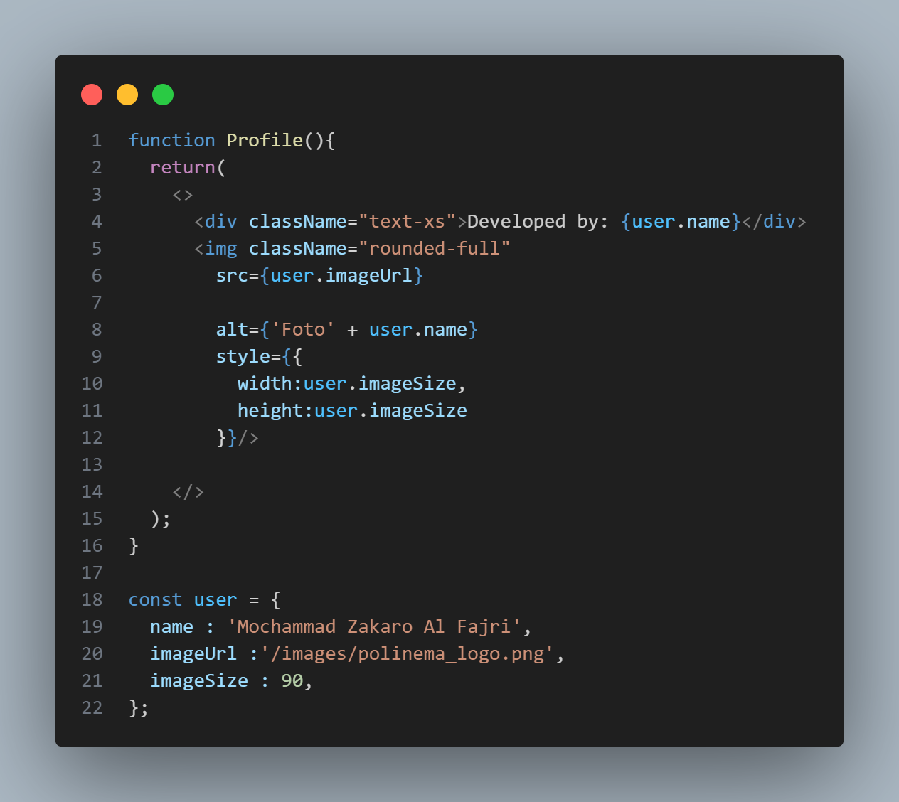
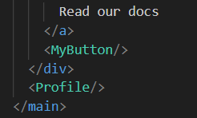
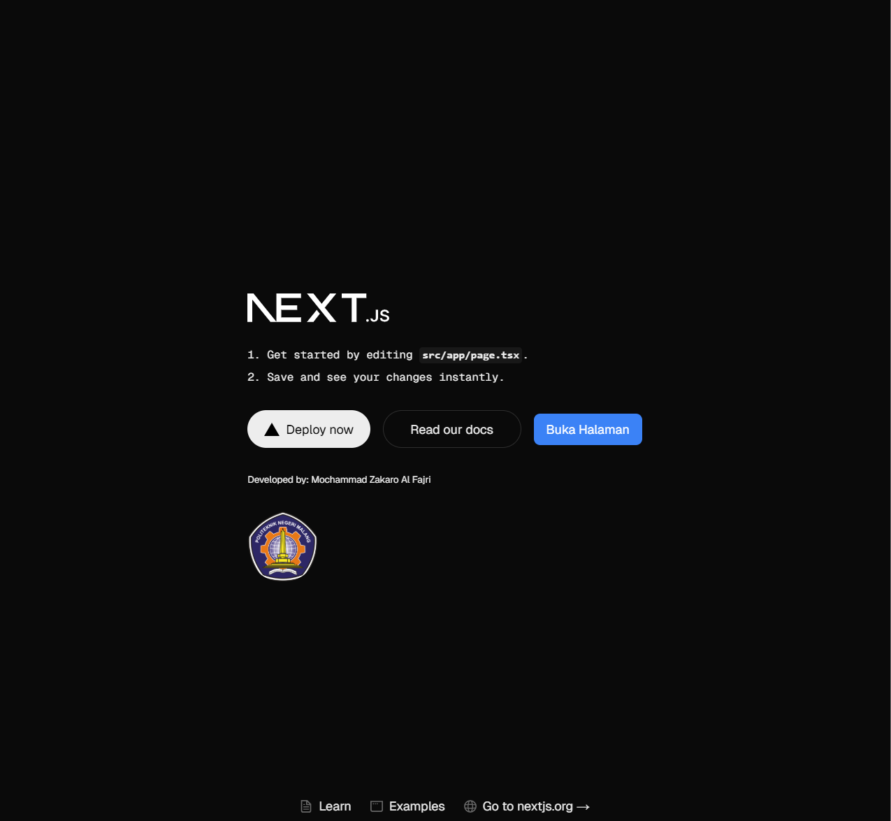

# Praktikum 4: Menulis Markup dengan JSX

|              | **Pemrograman Berbasis Framework 2025** |
|--------------|------------------------------------|
| **NIM**     | 2241720175                         |
| **Nama**    | Mochammad Zakaro Al Fajri          |
| **Kelas**   | TI - 3D                            |

## Soal Praktikum 4

1. Untuk apakah kegunaan sintaks user.imageUrl?

    Jawab : 

    - Sintaks user.imageUrl digunakan untuk mengambil dan mengakses url gambar yang ada di objek user dan url gambar nantinya digunakan  untuk menampilkan gambar di elemen

2. Buktikan dengan screenshoot yang menunjukkan bahwa tahapan percobaan di atas telah
berhasil Anda lakukan!

    Jawab : 
    
    - Langkah 1 : Tambahkan kode JSX di bawah ini ke dalam file page.tsx.

        

    - Tambahkan komponen MyProfile setelah kompnen MyButton.

        

    - Simpan dan amati perubahan di halaman web yang dihasilkan!

        
