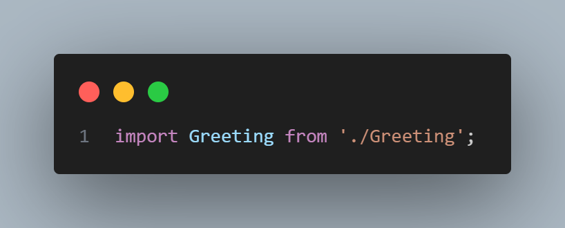

# 02 REACTJS | Laporan Praktikum Pertemuan 2 

|              | **Pemrograman Berbasis Framework 2025** |
|--------------|------------------------------------|
| **NIM**     | 2241720175                         |
| **Nama**    | Mochammad Zakaro Al Fajri          |
| **Kelas**   | TI - 3D                            |

## Praktikum 1: Persiapan Lingkungan

### Langkah 1 : Pastikan Node.js dan npm sudah terinstal di komputer Anda.

### Langkah 2 : Inisialisasi proyek React

### Langkah 3 : Jalankan aplikasi React 

## Praktikum 2 : Membuat Komponen React

### Langkah 1 : Buka file src/App.js di text editor Anda.

### Langkah 2 : Ganti kode di dalamnya sesuai dengan perintah.

### Output : 

## Praktikum 3 : Menggunakan JSX untuk Membuat Komponen Dinamis

### Langkah 1 : Buat file baru di direktori src dengan nama Counter.js.

### Langkah 2 : Tambahkan kode berikut untuk membuat komponen Counter.

### Langkah 3 : Buka file src/App.js dan impor komponen Counter.

### Langkah 4 : Tambahkan komponen Counter ke dalam komponen App.

### Output : 

## Praktikum 4 :  Menggunakan Props untuk Mengirim Data

### Langkah 1 : Buat file baru di direktori src dengan nama Greeting.js. 

### Langkah 2 : Tambahkan kode untuk membuat komponen Greeting yang menerima props

### Langkah 3 : Buka file src/App.js dan impor komponen Greeting

### Langkah 4 : Tambahkan komponen Greeting ke dalam komponen App dan kirim props name

### Output : 

## Praktikum 5 : Menggunakan State untuk Mengelola Data

### Langkah 1 : Buka file src/App.js dan tambahkan kode berikut untuk membuat komponen yang mengelola state

### Langkah 2 : Tambahkan komponen Example ke dalam komponen App

### output : 

## Soal

1. **Buat komponen baru bernama TodoList yang menampilkan daftar tugas (todo list). Gunakan state untuk mengelola daftar tugas dan props untuk mengirim data tugas ke komponen anak.**

    Jawab : 

    Komponen TodoList.js

    

    Penjelasan : 
    
    - State digunakan untuk menyimpan data dalam komponen React

    - state `todos` digunakan untuk menyimpan daftar tugas yang telah ditambahkan. `setTodos` adalah fungsi yang digunakan untuk memperbarui state `todos`.

    - State `newTodo` digunakan untuk menyimpan teks tugas yang sedang dimasukkan dalam input.  `setNewTodo` adalah fungsi yang digunakan untuk memperbarui nilai dari `newTodo`.

2. **Tambahkan fitur untuk menambahkan tugas baru ke dalam daftar menggunakan form input.**

    Jawab : 

    

    Penjelasan : 

    - Fungsi `addTodo` digunakan untuk menambahkan tugas baru jika input valid dan membersihkan kolom input setelahnya.

3. **Implementasikan fitur untuk menghapus tugas dari daftar.**

    Jawab : 

    

    Penjelasan : 

    - Fungsi `removeTodo` digunakan untuk  menghapus tugas berdasarkan indeks yang dipilih. Fungsi ini menggunakan `filter` untuk membuat array baru tanpa tugas yang akan dihapus.

### Output : 

