# 03 Pengenalan Next.js | Laporan Praktikum Pertemuan 3 

|              | **Pemrograman Berbasis Framework 2025** |
|--------------|------------------------------------|
| **NIM**     | 2241720175                         |
| **Nama**    | Mochammad Zakaro Al Fajri          |
| **Kelas**   | TI - 3D                            |

## Praktikum 1: Persiapan Lingkungan

### Langkah 1 : Pastikan Node.js dan npm sudah terinstal di komputer Anda.

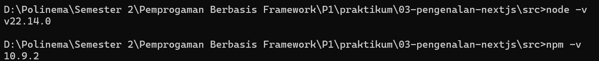

### Langkah 2 : Inisialisasi proyek Next.js

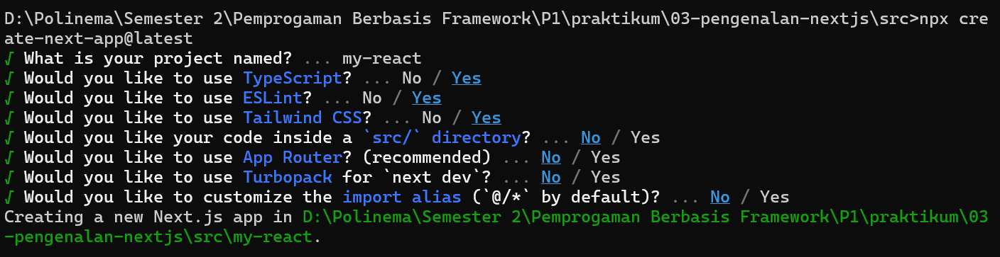

### Langkah 3 : Jalankan aplikasi Next.js. Aplikasi akan terbuka di browser pada alamat http://localhost:3000.

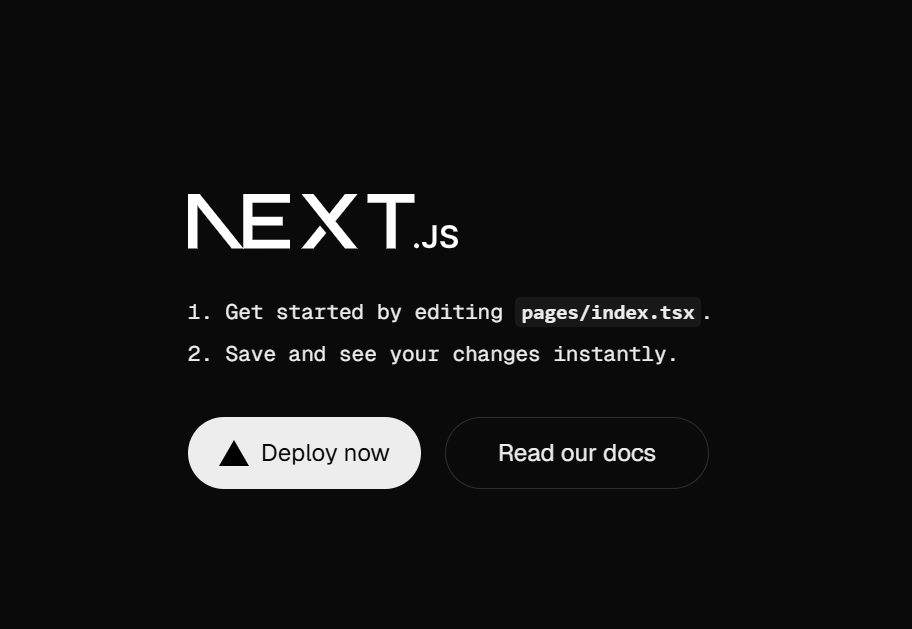

## Praktikum 2 : Membuat Halaman dengan Server-Side Rendering (SSR)

### Langkah 1 : Buka file pages/index.tsx dan ganti kode di dalamnya dengan kode berikut untuk membuat halaman sederhana:

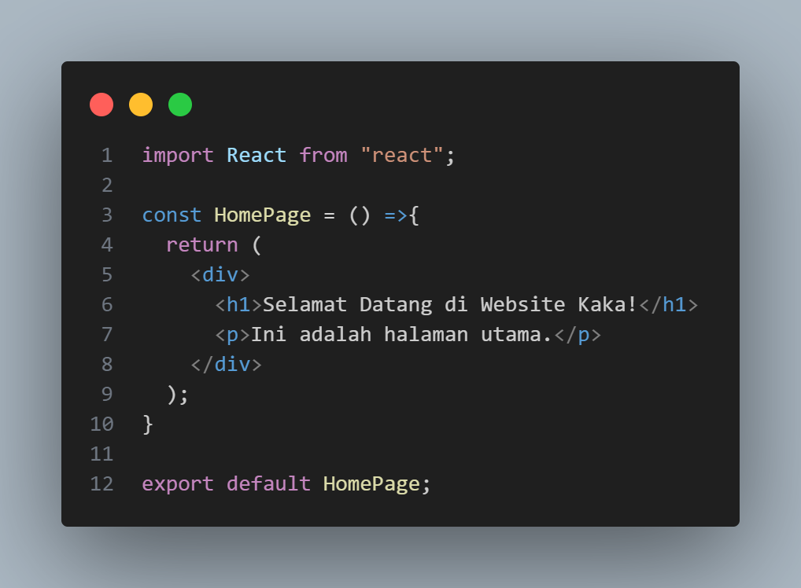

### Langkah 2 : Simpan file dan lihat perubahan di browser. Anda akan melihat halaman utama dengan teks "Selamat Datang di Website Saya!".

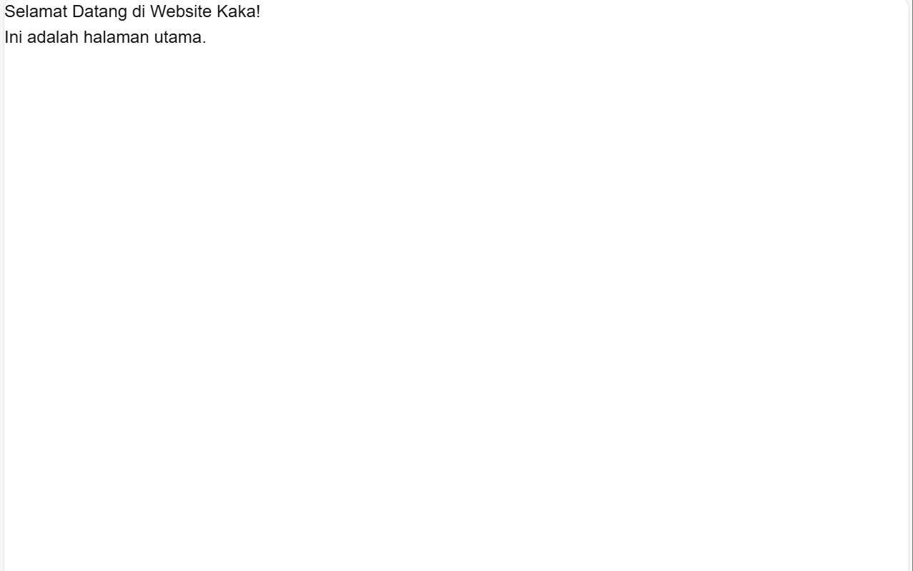

## Praktikum 3 : Menggunakan Static Site Generation (SSG)

### Langkah 1 : Buat file baru di direktori pages dengan nama blog.js.

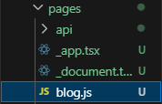

### Langkah 2 : Tambahkan kode berikut untuk membuat halaman blog dengan SSG

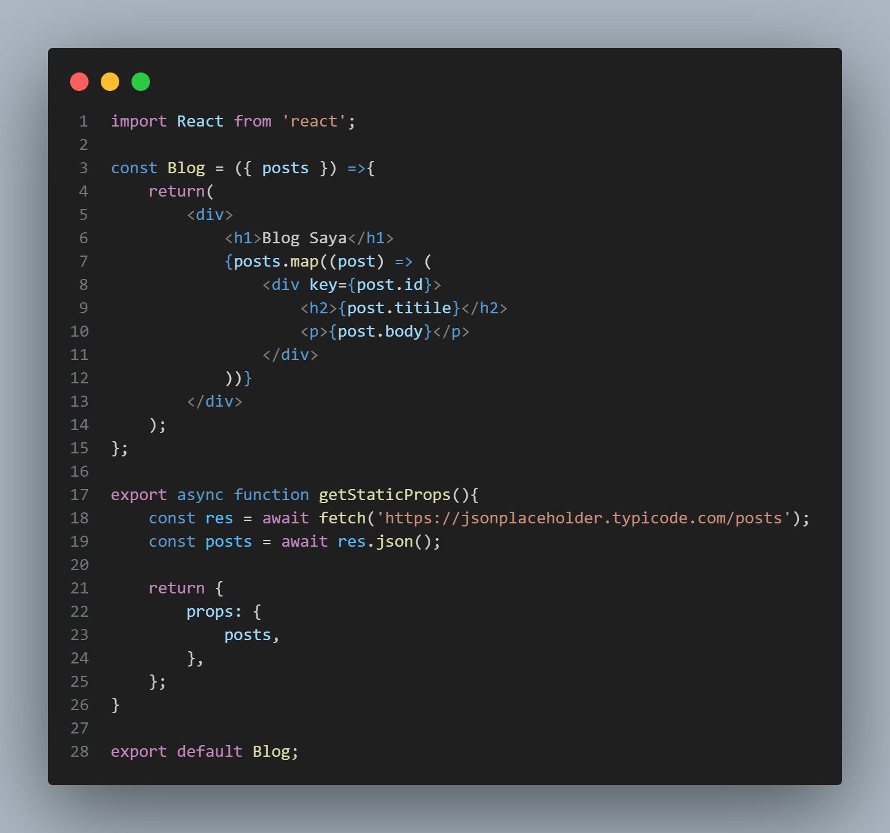

### Langkah 3 : Simpan file dan buka http://localhost:3000/blog di browser. Anda akan melihat daftar post yang diambil dari API eksternal

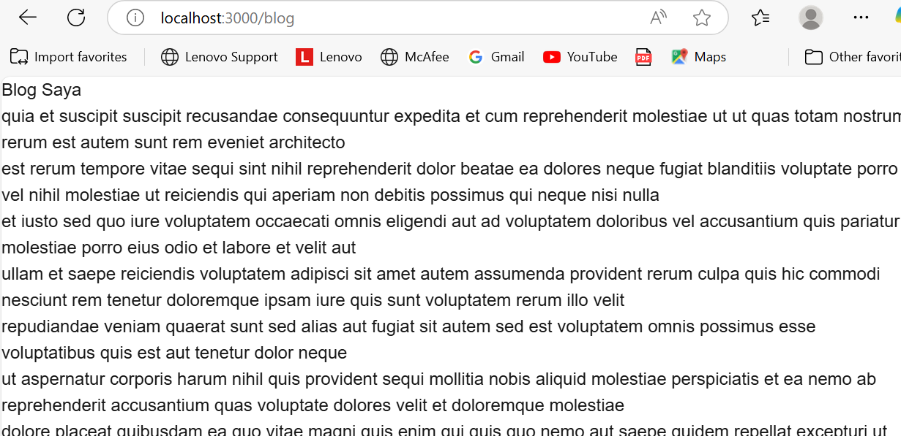

## Praktikum 4 : Menggunakan Dynamic Routes

### Langkah 1 : Buat direktori baru di pages dengan nama blog.cBuat file di dalam direktori blog dengan nama [slug].js

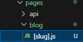

### Langkah 2 : Tambahkan kode berikut untuk membuat halaman dinamis berdasarkan slug

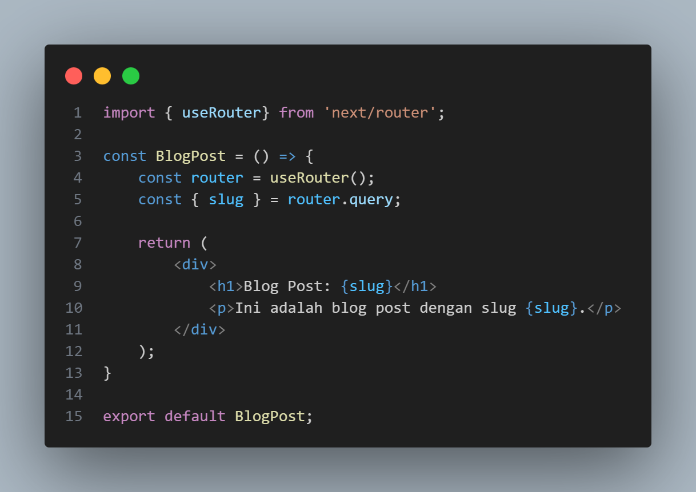

### Langkah 3 : Simpan file dan buka http://localhost:3000/blog/contoh-post di browser. Anda akan melihat halaman yang menampilkan slug dari URL.

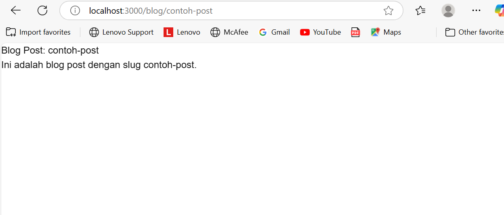

## Praktikum 5 : Menggunakan API Routes

### Langkah 1 : Pastikan terdapat direktori di pages dengan nama api dan buat file di dalam direktori api dengan nama products.js

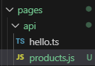

### Langkah 2 : Tambahkan kode berikut untuk membuat API route yang mengembalikan daftar produk

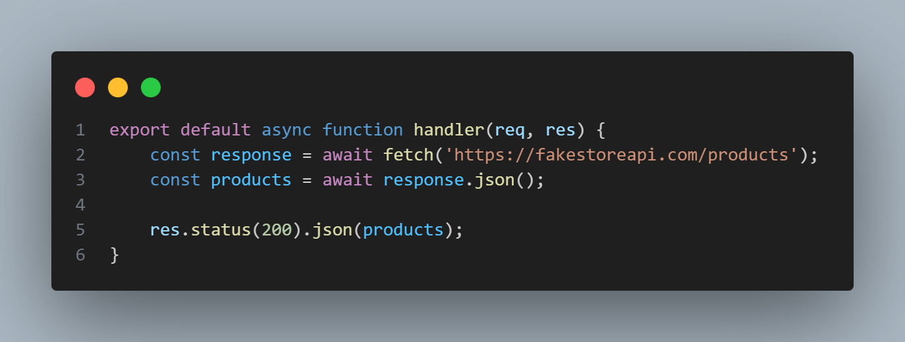

### Langkah 3 : Buat file baru di pages dengan nama products.js untuk menampilkan daftar produk

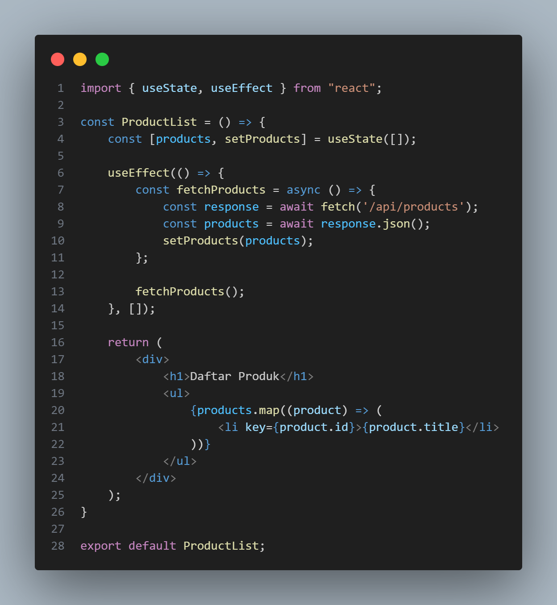

### Langkah 4 : Simpan file dan buka http://localhost:3000/products di browser. Anda akan melihat daftar produk yang diambil dari API route

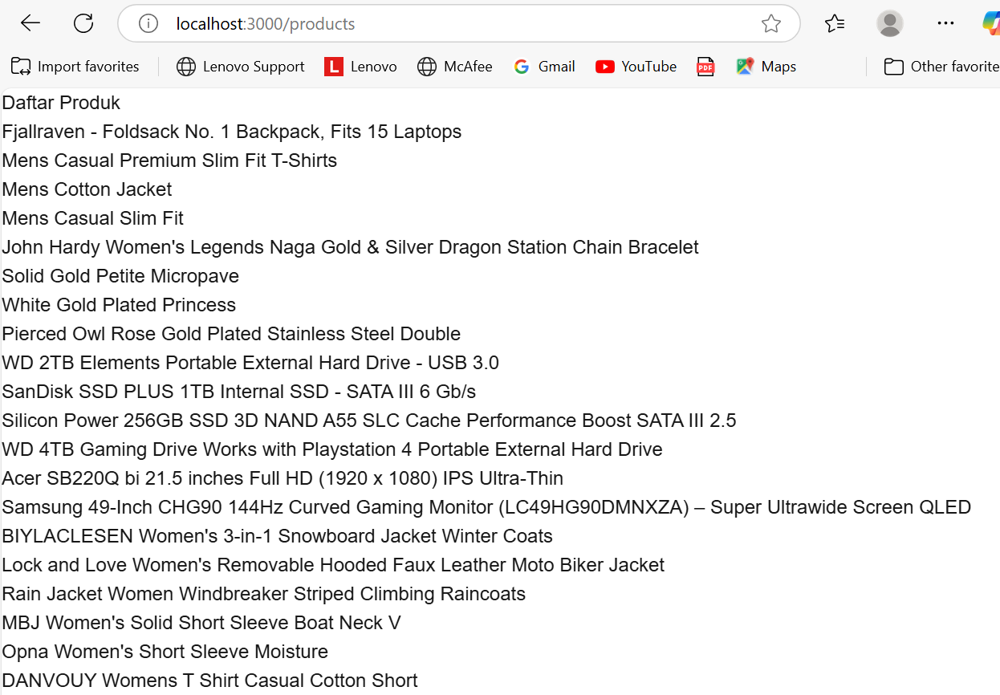

## Praktikum 6 : Menggunakan Link Component

### Langkah 1 : Buka file pages/index.tsx dan tambahkan modif dengan kode berikut untuk membuat link ke halaman lain.

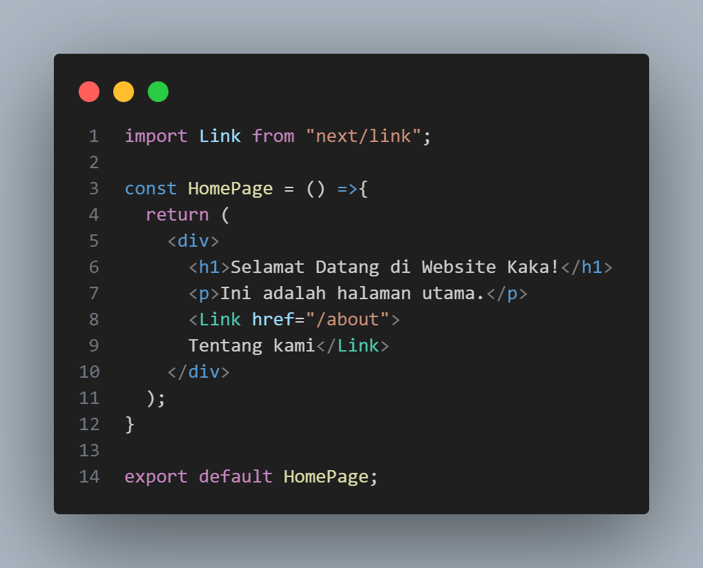

### Langkah 2 : Buat file baru di pages dengan nama about.js untuk halaman "Tentang Kami":

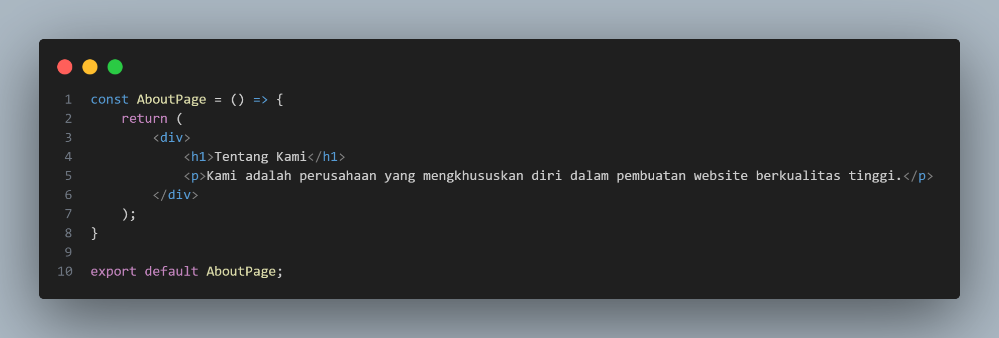

### Langkah 3 : Simpan file dan buka http://localhost:3000 di browser. Klik link "Tentang Kami" untuk navigasi ke halaman tentang.

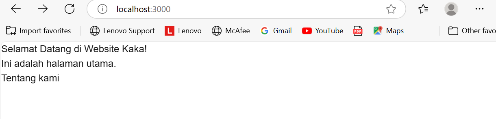
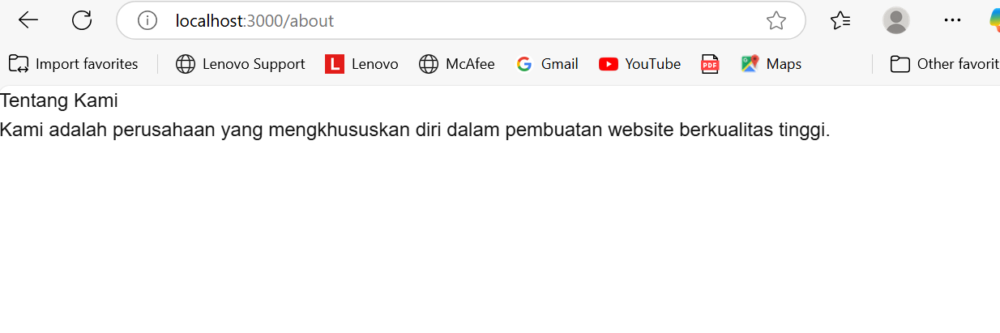