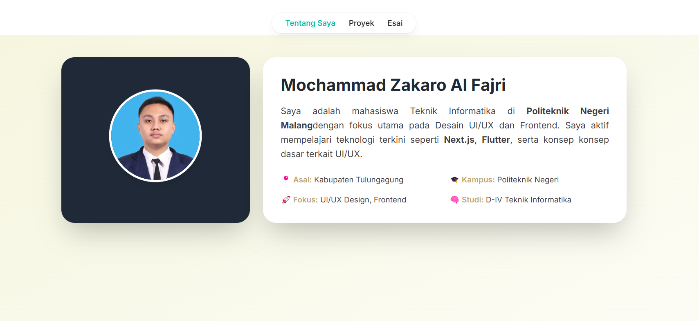

# Pertemuan 5 | Membangun Website Pribadi dengan Next.js (App Router), React, dan Tailwind CSS 

|              | **Pemrograman Berbasis Framework 2025** |
|--------------|------------------------------------|
| **NIM**     | 2241720175                         |
| **Nama**    | Mochammad Zakaro Al Fajri          |
| **Kelas**   | TI - 3D                            |

## Praktikum 1 : Persiapan Lingkungan

### Langkah 1 : Pastikan Node.js dan npm sudah terinstal di komputer Anda.

### Langkah 2 : Buat direktori baru dan Inisialisasi proyek Next.js 

### Langkah 3 : Buka app/layout.tsx, tambahkan import './globals.css', dan modifikasi menjadi sebagai berikut:

## Praktikum 2 : Membuat Halaman Website

### Langkah 1 : Buat file app/page.tsx sebagai halaman "Tentang Saya":

### Langkah 2 : Buat file app/projects/page.tsx sebagai halaman "Proyek"

### Langkah 3 : Buat file app/essays/page.tsx sebagai halaman "Esai"

### Langkah 4 : Buka browser dan akses : 

- http://localhost:3000/ untuk halaman "Tentang Saya".

    

- http://localhost:3000/projects untuk halaman "Proyek"

    

- http://localhost:3000/essays untuk halaman "Esai".
  
    

## Praktikum 3 : Membuat Layout dan Navigasi

**Layout digunakan untuk menyediakan struktur yang konsisten di seluruh halaman, seperti navbar dan footer.**

### Langkah 1 : Buat direktori src/components 

### Langkah 2 : Buat file src/components/Layout.tsx

### Langkah 3 : Buat file src/components/Navbar.tsx

### Langkah 4 : Buat file src/components/Footer.tsx

### Langkah 5 : Update file app/layout.tsx untuk menggunakan layout

### Langkah 6 : Update setiap halaman menambahkan metadata dengan generateMetadata

### Langkah 7 : Output 

## Praktikum 4 : Membuat Halaman Proyek dengan Grid Responsif

**Halaman proyek akan menampilkan daftar proyek dalam bentuk grid yang responsif.**

### Langkah 1 : Buat folder di public/images. Kemudian tambahkan dua image, lalu rename dengan nama project1.png dan project2.png

### Langkah 2 : Modifikasi file app/projects/page.tsx

- Tambahkan import next/image

    

- Buat card project item

    

- Modifikasi komponen project

    

### Langkah 3 : Output 

## Tugas 

1. **Modifikasi halaman "Esai" dengan Grid daftar artikel yang telah ditulis.**

    Jawab : 
    
    

2. **Modifikasi halaman “Tentang Saya” Buat tampilan yang menarik**

    Jawab : 
        
    
