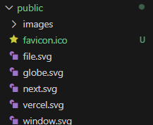
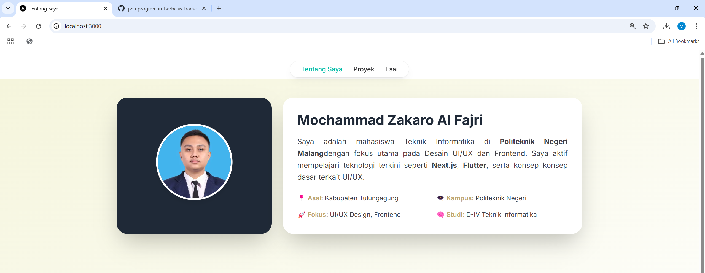
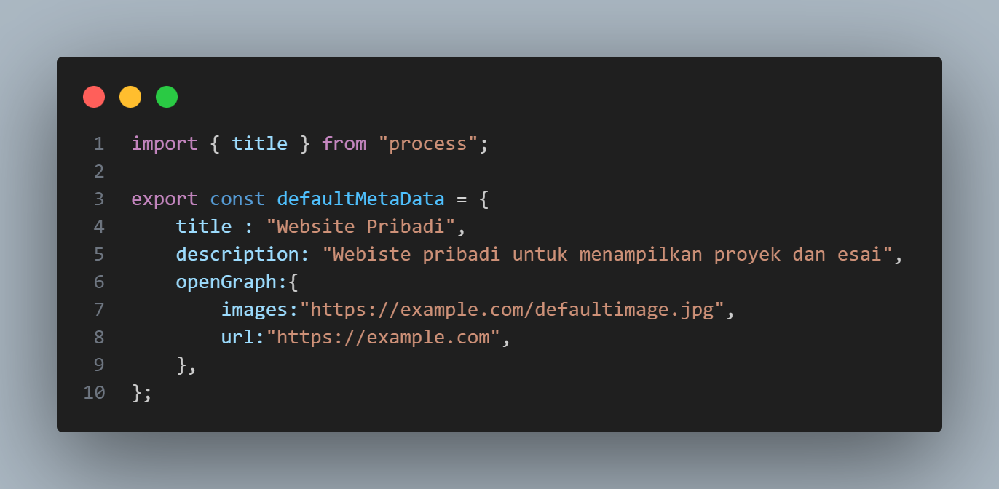
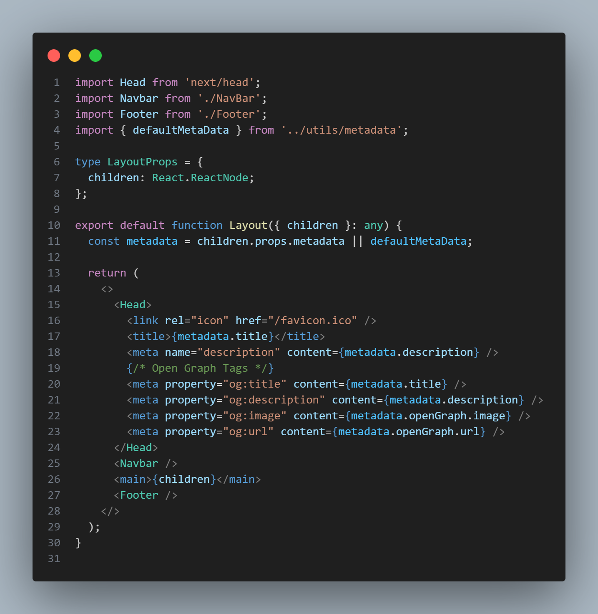
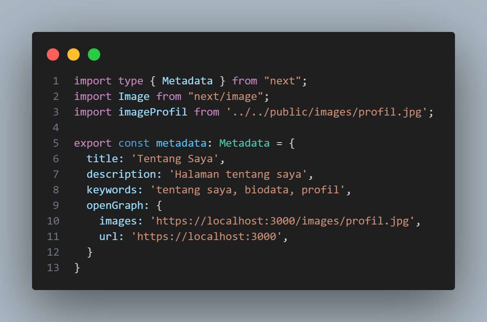
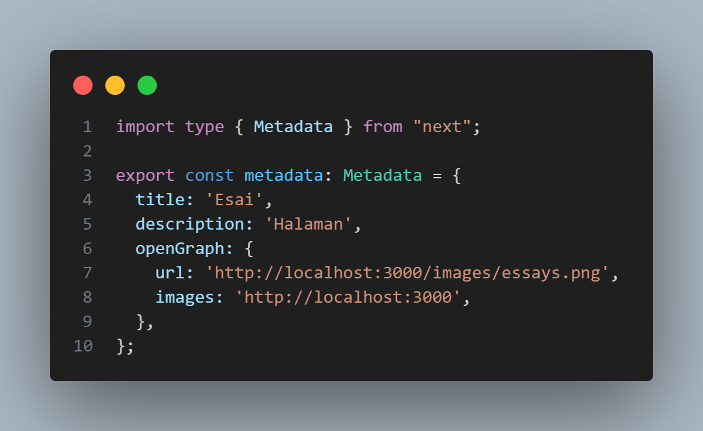
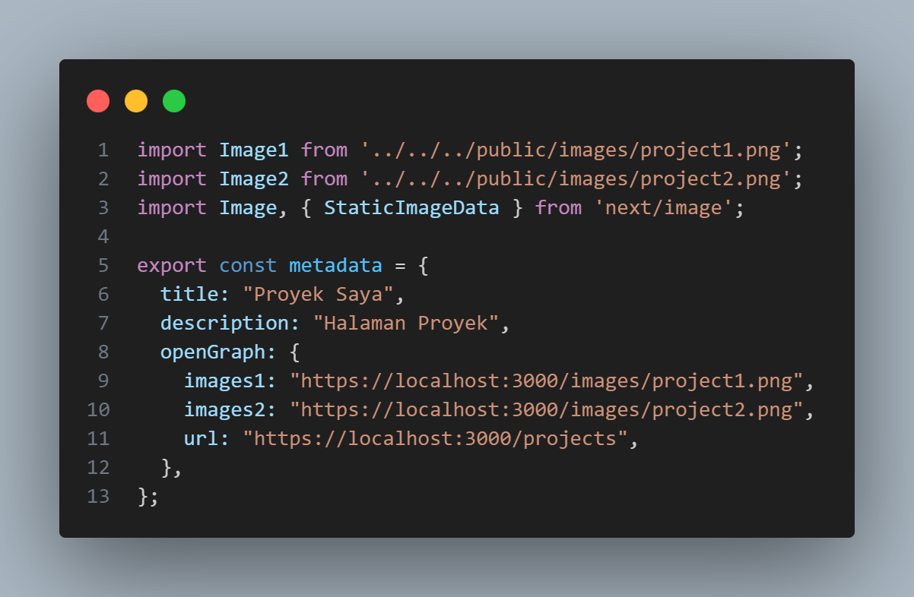
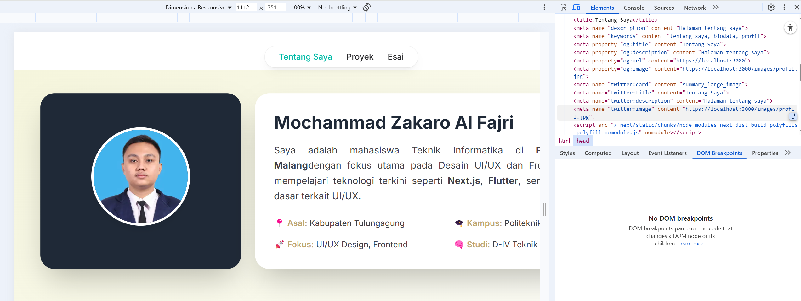

# Pertemuan 7 | Membuat Halaman yang SEO-Friendly dengan Next.js

|              | **Pemrograman Berbasis Framework 2025** |
|--------------|------------------------------------|
| **NIM**     | 2241720175                         |
| **Nama**    | Mochammad Zakaro Al Fajri          |
| **Kelas**   | TI - 3D                            |

## Praktikum 1 : Menambahkan Favicon

### Langkah 1 : . Siapkan file favicon (format .ico) dan letakkan di folder public/.

### Langkah 2 : Update file src/components/layout.tsx untuk menambahkan favicon:

### Langkah 3 : Simpan dan jalankan proyek. Favicon akan muncul di tab browser.

## Praktikum 2 : Menambahkan Metadata untuk SEO
**Metadata seperti title dan description sangat penting untuk SEO. Metadata ini akan muncul di hasil pencarian dan membantu mesin pencari memahami konten halaman.**

### Langkah 1 : Buat file src/utils/metadata.ts untuk menyimpan metadata default:

### Langkah 2 : Update file src/components/layout.tsx untuk menggunakan metadata default jika tidak ada metadata yang di-pass:

### Langkah 3 : Update Setiap Halaman untuk dapat mem-pass definisi metadata

- tentang saya : 

    

- esai : 

    

- proyek : 

    

## Praktikum 3 : Open Graph Tags untuk Media Sosial

**Open Graph Tags digunakan untuk mengontrol bagaimana konten Anda ditampilkan saat dibagikan di media sosial seperti Facebook dan Twitter.**

### Langkah 1 : Pastikan Anda telah menambahkan Open Graph Tags di layout.tsx seperti yang telah dijelaskan sebelumnya.

### Langkah 2 : Update metadata di setiap halaman untuk menyertakan Open Graph Tags.

## Praktikum 4 : Menguji SEO

**Halaman proyek akan menampilkan daftar proyek dalam bentuk grid yang responsif.**

## Tugas 

1. **Setelah menambahkan metadata, favicon, dan Open Graph Tags, Anda dapat menguji SEO dengan Membuka halaman di browser dan memeriksa elemen HTML menggunakan Developer Tools (Ctrl + Shift + I atau F12).**

   

2. **Modifikasi halaman “Tentang Saya” Buat tampilan yang menarik**

    Jawab : 

   
