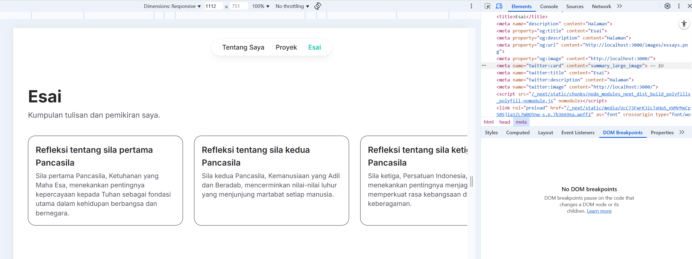

# Pertemuan 7 | Membuat Halaman yang SEO-Friendly dengan Next.js

|              | **Pemrograman Berbasis Framework 2025** |
|--------------|------------------------------------|
| **NIM**     | 2241720175                         |
| **Nama**    | Mochammad Zakaro Al Fajri          |
| **Kelas**   | TI - 3D                            |

## Praktikum 1 : Menambahkan Favicon

### Langkah 1 : . Siapkan file favicon (format .ico) dan letakkan di folder public/.

### Langkah 2 : Update file src/components/layout.tsx untuk menambahkan favicon:

### Langkah 3 : Simpan dan jalankan proyek. Favicon akan muncul di tab browser.

## Praktikum 2 : Menambahkan Metadata untuk SEO
**Metadata seperti title dan description sangat penting untuk SEO. Metadata ini akan muncul di hasil pencarian dan membantu mesin pencari memahami konten halaman.**

### Langkah 1 : Buat file src/utils/metadata.ts untuk menyimpan metadata default:

### Langkah 2 : Update file src/components/layout.tsx untuk menggunakan metadata default jika tidak ada metadata yang di-pass:

### Langkah 3 : Update Setiap Halaman untuk dapat mem-pass definisi metadata

- tentang saya : 

    

- esai : 

    

- proyek : 

    

## Praktikum 3 : Open Graph Tags untuk Media Sosial

**Open Graph Tags digunakan untuk mengontrol bagaimana konten Anda ditampilkan saat dibagikan di media sosial seperti Facebook dan Twitter.**

### Langkah 1 : Pastikan Anda telah menambahkan Open Graph Tags di layout.tsx seperti yang telah dijelaskan sebelumnya.

### Langkah 2 : Update metadata di setiap halaman untuk menyertakan Open Graph Tags.

## Praktikum 4 : Menguji SEO

### Setelah menambahkan metadata, favicon, dan Open Graph Tags, Anda dapat menguji SEO dengan Membuka halaman di browser dan memeriksa elemen HTML menggunakan Developer Tools (Ctrl + Shift + I atau F12).

- Tentang saya 

    

- Projek 

    

- Esai 

    
## Tugas 

#### Lakukan pengujian SEO dengan Gunakan tools seperti Google Search Console untuk memeriksa performa SEO dari suatu website.

Jawab : 

1. Pengujian menggunakan Google Search Console

    Hasil Pengujian : 

    - Verifikasi properti website berhasil tetapi laporan performa belum muncul dikarenakan website baru melakukan pendaftaran

        

2. Pengujian webiste `shopee.co.id` menggunakan ubbersuggest

    Jawab : 
    
    

    - Traffic Overview : gambaran umum mengenai performa lalu lintas situs web berdasarkan data kunjungan pengguna

        - Organic Traffic : jumlah kunjungan ke situs web yang berasal dari hasil pencarian alami di mesin pencari (tanpa iklan). Shopee.co.id menerima sekitar 131,4 juta kunjungan per bulan secara organik, atau 99,99% dari total traffic menunjukkan bahwa performa SEO Shopee sangat optimal

        - Paid traffic : Shopee hanya memperoleh 2.984 kunjungan berbayar, yaitu 0,01% dari total traffic. Ini mengindikasikan bahwa Shopee tidak bergantung pada iklan digital berbayar
    
    - Organic Keywords :  
    
        - jumlah kata kunci yang membuat halaman situs muncul di hasil pencarian Google tanpa iklan. 
        - Shopee terindeks untuk lebih dari 6,9 juta kata kunci, yang mencerminkan tingkat visibilitas SEO yang sangat luas dan struktur konten yang dioptimalkan secara menyeluruh.

    - Domain Authority : 

        - Metrik penilaian dari 1 hingga 100 yang digunakan untuk memperkirakan kemampuan sebuah domain untuk bersaing di hasil pencarian Google

        - Skor DA sebesar 89 tergolong sangat tinggi, menunjukkan bahwa Shopee memiliki reputasi teknis dan kredibilitas digital yang sangat kuat.

    - Backlinks : 

        - Tautan dari situs lain yang mengarah ke situs kita dan merupakan faktor penting dalam algoritma peringkat mesin pencari.

        - Shopee memiliki lebih dari 56 juta backlink, dengan 9,6 juta di antaranya merupakan tautan NoFollow. Jumlah ini menunjukkan tingkat kepercayaan dan dukungan eksternal yang masif terhadap situs Shopee.

    - Paid Keywords : 

        -  kata kunci yang digunakan dalam iklan berbayar untuk menarik pengunjung ke situs.

        - Shopee hanya menggunakan 163 kata kunci untuk iklan berbayar, yang tergolong sangat minim. Ini menegaskan bahwa strategi digital Shopee lebih menitikberatkan pada SEO dibandingkan iklan berbayar.